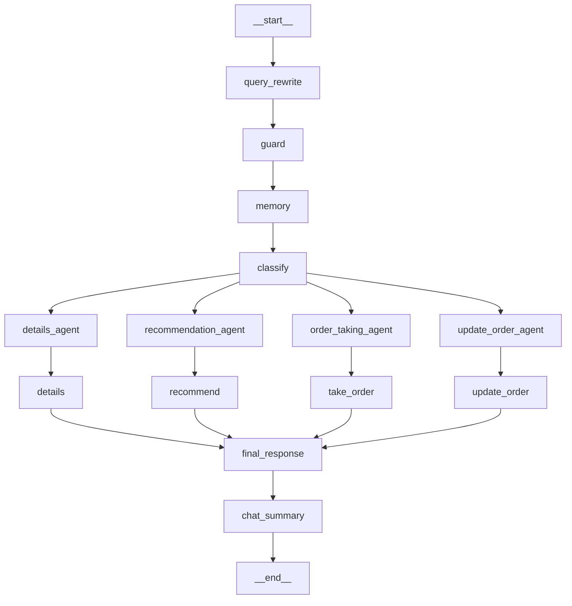

# ☕ Coffee Shop Chatbot

This is a multi-agent, modular chatbot system designed for automating a coffee shop's customer interactions, such as placing orders, updating them, and getting recommendations or menu details. The system leverages **agent-based design** for scalability, flexibility, and contextual intelligence.

---

## 🔁 Architecture Overview



---

## 🧠 Key Components

| Module | Description |
|--------|-------------|
| `query_rewrite` | Rewrites and normalizes the user's query to a clean format |
| `guard` | Initial validation/filtering of unsafe or irrelevant queries |
| `memory` | Loads relevant chat history and user profile |
| `classify` | Classifies the user query into a specific agent route |
| `details_agent` | Handles menu details or drink information queries |
| `recommendation_agent` | Suggests drinks based on history or preferences |
| `order_taking_agent` | Handles new orders from users |
| `update_order_agent` | Handles changes to existing orders |
| `final_response` | Consolidates and formats the agent output |
| `chat_summary` | Updates the session summary and memory |
| `__start__`, `__end__` | Represent session lifecycle |

---

## 📦 Features

- **Multi-agent system** with clear separation of concerns
- **Memory integration** for long-term and session-based user context
- **Agentic RAG (Retrieval-Augmented Generation)** for enhanced menu/recommendation understanding
- **Short-term memory** (chat history) and **long-term memory** (user profile)
- **Modular design**: Easy to add/modify agents

---

## 🚀 Getting Started

### 1. Clone the Repo
```bash
git clone https://github.com/yourusername/coffee-shop-chatbot.git
cd coffee-shop-chatbot
```

### 2. Install Requirements
```bash
pip install -r requirements.txt
```

### 3. Run the App
```bash
uvicorn app.main:app --reload
```

---

## 📌 Example Queries

- “Can you recommend me a cold drink?”
- “What’s in the Espresso Delight?”
- “I want to order a cappuccino.”
- “Change my order to a hot chocolate.”


---

## 🛠 Tech Stack

- Python (FastAPI or Flask)
- LLMs (Groq with LLaMA3, BGE embeddings)
- LangChain / LangGraph
- Supabase / PineCone (memory backend)

---

## 🧩 Future Work

- User authentication and session handling
- Payment integration
- Voice assistant support
- Analytics dashboard for shop owner

---

## 🤝 Contributing

Contributions and ideas are welcome! Please open issues or submit a pull request.
