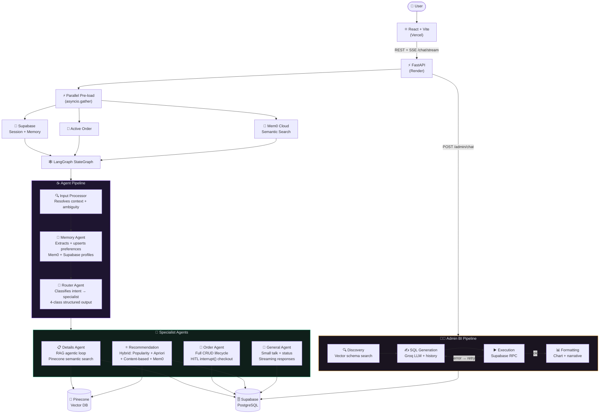

<div align="center">


<p align="center">
  
  
  
  
  
  
  
  
</p>

<p align="center">
  <a href="https://coffee-shop-chat-bot.vercel.app"><strong>🌐 Live Demo</strong></a> &nbsp;·&nbsp;
  <a href="https://coffee-shop-chatbot.onrender.com/docs"><strong>📡 API Docs</strong></a> &nbsp;·&nbsp;
  <a href="https://www.youtube.com/watch?v=APp6CWFgrXw"><strong>🎥 Video Walkthrough</strong></a>
</p>

<br/>

> **A production-grade multi-agent AI system** that turns natural language into a fully managed coffee shop experience — orders, personalized recommendations, persistent user memory, real-time streaming responses, HITL checkout, and an admin BI Intelligence dashboard — all through a single conversational interface.

</div>

---

## ✨ What's New (Latest Updates)

| Feature | Description | Status |
|---------|-------------|--------|
| **🧑‍💼 Admin BI Agent** | Text-to-SQL analytics dashboard with chart rendering (bar/pie/line), persistent session history, and PII redaction | ✅ Shipped |
| **⚡ SSE Token Streaming** | Real-time token-by-token streaming via Server-Sent Events — first token in < 500ms | ✅ Shipped |
| **🔄 Admin Chat Persistence** | Admin conversation history now restores on page refresh via Supabase-backed sessions | ✅ Shipped |
| **🧠 Semantic Memory (Mem0)** | Long-term semantic user memory via Mem0 Cloud — searched in parallel before every chat turn | ✅ Shipped |
| **⏸️ HITL Checkout** | Human-in-the-loop order confirmation using LangGraph `interrupt()` — graph pauses, waits for user approval | ✅ Shipped |
| **📧 Email Receipts** | Automated order receipt emails with itemized breakdown sent on confirmation | ✅ Shipped |
| **🔁 Auto-retry SQL** | Admin BI Agent retries failed SQL queries up to 2 times with error context injected back into the prompt | ✅ Shipped |
| **🔒 Privacy Redaction** | PII (emails, customer names) masked from all SQL results before LLM sees them | ✅ Shipped |
| **🛍️ 58-item Product Catalog** | Full menu with AI-generated images, ingredient metadata, and Pinecone vector embeddings | ✅ Shipped |

---

## 🧠 Why This Exists

Most AI chatbots treat every message the same way: one prompt, one LLM call, one response. That works for FAQs. It breaks down the moment you need real business logic — allergy filtering, live price lookups, order lifecycle management, semantic search over a product catalog, long-term user memory, and business intelligence on top of a live database.

Merry's Way is built on a different premise: **each concern deserves its own agent, with its own tools, context window, and failure boundary.** A Router agent that classifies intent has no business knowing order history. An Admin BI agent that runs SQL has no business touching customer PII. This separation is what makes the system both maintainable and production-capable.

---

## 🏗️ System Architecture


```mermaid
flowchart TD
    User(["👤 User"]) --> FE["⚛️ React + Vite\n(Vercel)"]
    FE -->|"REST + SSE /chat/stream"| API["⚡ FastAPI\n(Render)"]
    API --> PRL["⚡ Parallel Pre-load\n(asyncio.gather)"]

    PRL --> SM["🧠 Supabase\nSession + Memory"]
    PRL --> ORD["🛒 Active Order"]
    PRL --> M0["🔮 Mem0 Cloud\nSemantic Search"]

    SM & ORD & M0 --> Graph["🕸️ LangGraph StateGraph"]

    subgraph PIPELINE ["☕ Agent Pipeline"]
        direction TB
        IP["🔍 Input Processor\nResolves context + ambiguity"]
        MEM["🧠 Memory Agent\nExtracts + upserts preferences\nMem0 + Supabase profiles"]
        RTR["🔀 Router Agent\nClassifies intent → specialist\n4-class structured output"]

        IP --> MEM --> RTR
    end

    subgraph SPECIALISTS ["🎯 Specialist Agents"]
        direction LR
        Details["📋 Details Agent\nRAG agentic loop\nPinecone semantic search"]
        Order["🛒 Order Agent\nFull CRUD lifecycle\nHITL interrupt() checkout"]
        Recommend["⭐ Recommendation\nHybrid: Popularity + Apriori\n+ Content-based + Mem0"]
        General["💬 General Agent\nSmall talk + status\nStreaming responses"]
    end

    Graph --> PIPELINE --> SPECIALISTS

    Details & Order & Recommend & General --> DB[("🗄️ Supabase\nPostgreSQL")]
    Details & Recommend --> VDB[("🔷 Pinecone\nVector DB")]

    subgraph ADMIN ["🧑‍💼 Admin BI Pipeline"]
        direction LR
        Disc["🔍 Discovery\nVector schema search"]
        Gen["✍️ SQL Generation\nGroq LLM + history"]
        Exec["▶️ Execution\nSupabase RPC"]
        Fmt["📊 Formatting\nChart + narrative"]
        Disc --> Gen --> Exec -->|"error → retry"| Gen
        Exec -->|"ok"| Fmt
    end

    API -->|"POST /admin/chat"| ADMIN
    ADMIN --> DB

    style PIPELINE fill:#1e1530,stroke:#7c3aed,color:#e2e8f0
    style SPECIALISTS fill:#0f1f1a,stroke:#10b981,color:#e2e8f0
    style ADMIN fill:#1a1420,stroke:#f59e0b,color:#e2e8f0
```

---

## 🤖 Agent Deep Dive

### Customer-Facing Pipeline

| Agent | Model | Responsibility | Key Design |
|-------|-------|---------------|------------|
| **Input Processor** | Small LLM | Resolves pronouns, ellipsis, and ambiguity before routing | "Two of those" → "Two Cappuccinos" |
| **Memory Agent** | Full LLM | Extracts + persists user preferences from every turn | Writes to Supabase + Mem0 Cloud atomically |
| **Router** | Small LLM | 4-class intent classifier (Details / Order / Recommend / General) | Structured output, few-shot examples per boundary |
| **Details** | Full LLM | Product info via agentic RAG tool-calling loop | Can re-query Pinecone with refined terms |
| **Order** | Full LLM | Full CRUD order lifecycle with HITL checkout | Prices always from Supabase — never LLM-generated |
| **Recommendation** | Full LLM | Hybrid recommender (popularity + apriori + content-based + Mem0) | Allergen filter is a Python hard constraint, not LLM reasoning |
| **General** | Full LLM | Greetings, small talk, order status | Streaming-first — SSE token output |

### Admin BI Pipeline (4-Node LangGraph)

| Node | What It Does |
|------|-------------|
| **Discovery** | Embeds the query → vector searches `coffee_shop_schema_metadata` → builds schema context with global table overview + relevant columns |
| **Generation** | Feeds schema context + conversation history + error (on retry) into Groq LLM → generates raw PostgreSQL |
| **Execution** | Runs SQL via Supabase `execute_sql_query` RPC → returns results or error message |
| **Formatting** | LLM formats results into `{narrative, chart_type, chart_data, sql}` structured state → React renders chart |

**Self-healing**: If SQL execution fails, the graph routes back to Generation with the error injected into the prompt — up to 2 retries.  
**Privacy**: PII (emails, names) are masked before results reach the LLM.

---

## 📦 Feature Breakdown

### 🔐 Authentication
JWT-based auth via Supabase Auth. Every `/chat` request is authenticated — `user_email` from the token is the partition key for all per-user data (memory, sessions, orders, admin sessions).

### 🧠 Two-Layer Persistent Memory

```
Layer 1 — Structured (Supabase)          Layer 2 — Semantic (Mem0 Cloud)
┌─────────────────────────────┐          ┌─────────────────────────────┐
│ coffee_shop_profiles table  │          │ Vector-based episodic store │
│ • likes, dislikes           │          │ • Natural language memories │
│ • allergies (hard filter!)  │  +       │ • "User always orders oat   │
│ • last_order                │          │   milk, never has sugar"    │
│ • feedback[]                │          │ • Searched in parallel on   │
└─────────────────────────────┘          │   every chat turn           │
                                         └─────────────────────────────┘
```

Both layers are searched **in parallel** (`asyncio.gather`) before the graph is invoked — adding zero sequential latency.

### ⚡ Real-Time Token Streaming

The `/chat/stream` endpoint uses **Server-Sent Events (SSE)** with LangGraph's `astream_events` API. The frontend receives three event types:

```
data: {"type": "status", "node": "router_agent"}     ← agent switching indicator
data: {"type": "token", "content": "Here's what..."}  ← streamed token
data: {"type": "interrupt", "payload": {...}}         ← HITL checkout pause
```

### ⏸️ Human-in-the-Loop Checkout

The Order agent uses LangGraph's `interrupt()` to pause graph execution before confirming an order. The graph state is checkpointed. The frontend renders a payment approval UI, and `/chat/resume` resumes the graph with the user's decision — no re-processing of the entire conversation.

```
User: "confirm my order"
   ↓
[Graph Pauses] → Frontend shows approval UI
   ↓
User clicks Confirm
   ↓
POST /chat/resume → Graph resumes → Email receipt sent
```

### ⭐ Hybrid Recommendation Engine

Three signals combined at inference time, with hard post-retrieval safety filters:

```python
final_score[item] = (
    0.20 × popularity_score     # Global transaction frequency
  + 0.50 × apriori_score        # Market basket (co-purchase confidence)
  + 0.30 × content_score        # Cosine similarity to user preference vector
)
# Then: filter out allergens + dislikes + cart items in Python (not LLM)
```

### 🧑‍💼 Admin BI Intelligence Dashboard

An Uber-style SQL analytics chatbot for shop owners:

- **Natural language → PostgreSQL** with automatic schema discovery (pgvector semantic search over column/table metadata)
- **Chart rendering**: bar, pie, line charts rendered by Recharts directly from structured agent state
- **Persistent sessions**: conversation history saved to Supabase, restored on refresh
- **Self-healing SQL**: up to 2 automatic retries with error context
- **PII redaction**: emails and customer names masked before LLM sees results

---

## 🛠️ Tech Stack

### Backend
| Layer | Technology |
|-------|-----------|
| Runtime | Python 3.12, FastAPI, Uvicorn |
| Agent Framework | LangGraph (StateGraph, interrupt, checkpointing), LangChain |
| LLM | Groq (`llama-3.3-70b-versatile`) with OpenRouter fallback |
| Embeddings | `BAAI/bge-base-en-v1.5` via HuggingFace Inference API |
| Semantic Memory | Mem0 Cloud (MemoryClient v2) |
| Vector Store | Pinecone — product catalog semantic search |
| Database | Supabase (PostgreSQL + Auth + Storage + pgvector) |
| Recommender | scikit-learn (cosine similarity, MultiLabelBinarizer) + Apriori JSON |
| Dependency Mgmt | `uv` + `pyproject.toml` |

### Frontend
| Layer | Technology |
|-------|-----------|
| Framework | React 18, Vite |
| Styling | Tailwind CSS + custom animations |
| Charts | Recharts (bar, pie, line) |
| Markdown | react-markdown + remark-gfm |
| Streaming | Native EventSource (SSE) |
| State | React Context (AuthContext, CartContext) |

### Infrastructure
| Component | Platform |
|-----------|---------|
| Backend | Render (Docker, auto-deploy from `main`) |
| Frontend | Vercel (SPA rewrites via `vercel.json`) |
| Config | `render.yaml` — one-click Render deploy |
| Observability | LangSmith tracing + structured logging |

---

## 🗂️ Project Structure

```
Coffee_Shop_ChatBot/
├── backend/
│   ├── api/
│   │   ├── routers/               # auth, chat, orders, products, users, admin
│   │   ├── auth/                  # Supabase JWT adapter
│   │   └── schemas.py             # Pydantic request/response models
│   ├── src/
│   │   ├── agents/
│   │   │   ├── input_processor_agent/   # Resolves ambiguity + context
│   │   │   ├── memory_management_agent/ # Extracts + persists preferences
│   │   │   ├── router_agent/            # Intent classification
│   │   │   ├── details_management_agent/# RAG agentic tool-calling loop
│   │   │   ├── order_management_agent/  # CRUD + HITL checkout
│   │   │   ├── recommendation_management_agent/ # Hybrid recommender
│   │   │   ├── general_agent/           # Small talk + streaming
│   │   │   └── admin/admin_agent/       # BI Text-to-SQL pipeline
│   │   ├── graph/                 # LangGraph state + graph builder
│   │   ├── memory/                # Supabase CRUD + Mem0 manager
│   │   ├── orders/                # Order persistence layer
│   │   ├── rag/                   # Pinecone retriever (pooled, lazy)
│   │   ├── recommender/           # HybridRecommender (fit/recommend/persist)
│   │   ├── sessions/              # Atomic message append via RPC
│   │   ├── tools/                 # RAG tool, product info, about-us
│   │   └── utils/                 # LLM pool, email, logger
│   ├── scripts/                   # DB seeding, image migration, BI agent setup
│   ├── data/
│   │   ├── products_data/         # products.jsonl + about-us copy
│   │   ├── apriori_recommendations.json
│   │   └── popularity_recommendation.csv
│   └── supabase_db/schema.sql     # Full DB schema
├── frontend/
│   ├── src/
│   │   ├── components/            # Chatbot, AdminDashboard, Menu, Order, Auth
│   │   ├── context/               # AuthContext, CartContext
│   │   └── services/api.js        # Centralised API layer — all fetch calls here
│   └── vercel.json                # SPA rewrite rules
└── render.yaml                    # Render deploy config
```

---

## 🔧 Key Engineering Challenges & Solutions

### 1. Race Condition on Message Persistence

**Symptom**: Concurrent requests (page reload + active chat) caused messages to overwrite each other — one message would be lost.

**Root cause**: Read-Modify-Write pattern in Python. Two coroutines read the same `messages[]` array, each appended their message locally, and the slower write silently won.

**Fix**: Replaced all message saves with an **atomic Supabase RPC** (`append_chat_messages`). The append is now done entirely on the database side using JSONB array concatenation — no Python-side read required. Race condition eliminated.

---

### 2. Admin SQL: LLM-Generated Queries Breaking Supabase RPC

**Symptom**: LLMs often return SQL with markdown fences (` ```sql `) and trailing semicolons — both of which break Supabase's `execute_sql_query` RPC wrapper.

**Fix**: Added a `scrub_sql()` function that strips markdown fences and trailing semicolons before execution. Combined with a 2-retry self-healing loop that feeds the error message back into the generation prompt.

---

### 3. Allergen Filter Reliability

**Symptom**: A user with a documented nut allergy was occasionally recommended hazelnut products when the LLM reasoned about ingredients.

**Root cause**: Allergen filtering was delegated to LLM reasoning — inherently probabilistic.

**Fix**: Allergen filtering moved to a **Python hard constraint** applied post-retrieval. The LLM never sees allergen-incompatible candidates.

---

### 4. macOS vs. Linux psycopg Crash

**Symptom**: PostgreSQL checkpointer (`PostgresSaver`) caused psycopg to segfault on macOS ARM when forked by Uvicorn.

**Fix**: OS-aware checkpointer factory — `MemorySaver` on macOS dev, `PostgresSaver` (via connection pool) on Linux production. Detected via `platform.system()` at startup.

---

### 5. Admin Chat History Lost on Page Refresh

**Symptom**: Admin BI conversations disappeared completely on page refresh — unlike the user chatbot which restored correctly.

**Root cause**: `AdminDashboard.jsx` only showed a static welcome message on mount. The backend was saving history to Supabase correctly, but the frontend never fetched it back.

**Fix**: Added `GET /admin/history` endpoint + `useEffect` on mount that fetches and reconstructs the full conversation (including chart state) from Supabase.

---

## 🚀 Local Development

### Prerequisites
- Python 3.12+, Node 18+
- Accounts: Supabase, Pinecone, Groq (or OpenRouter), HuggingFace, Mem0

### Backend

```bash
cd backend

# Install uv (if not already)
pip install uv

# Create venv + install deps
uv sync

# Copy and fill env
cp .env.example .env  # fill in all API keys

# Run dev server
uv run uvicorn api.main:app --reload --reload-dir api --reload-dir src
# API:  http://localhost:8000
# Docs: http://localhost:8000/docs
```

### Frontend

```bash
cd frontend
npm install
echo "VITE_API_URL=http://localhost:8000" > .env
npm run dev
# App: http://localhost:5173
```

---

## 🔑 Environment Variables

### Backend `.env`

```env
# ── LLM ───────────────────────────────────────────────────────────────────────
GROQ_API_KEY=
GROQ_MODEL=llama-3.3-70b-versatile

# Fallback (optional)
OPENROUTER_API_KEY=
LLM_MODEL=arcee-ai/trinity-large-preview:free

# ── Embeddings ────────────────────────────────────────────────────────────────
HF_API_KEY=
EMBEDDING_MODEL=BAAI/bge-base-en-v1.5

# ── Semantic Memory ───────────────────────────────────────────────────────────
MEM0_API_KEY=

# ── Vector Store ──────────────────────────────────────────────────────────────
PINECONE_API_KEY=
PINECONE_INDEX_NAME=coffee-products

# ── Database ──────────────────────────────────────────────────────────────────
SUPABASE_URL=
SUPABASE_KEY=           # anon/public key (for auth verification)
SUPABASE_SERVICE_KEY=   # service role key (for all DB ops — never expose to frontend)
SUPABASE_DB_URL=        # postgres:// URI (for LangGraph PostgresSaver on Render)

# ── Email ─────────────────────────────────────────────────────────────────────
RESEND_API_KEY=
FROM_EMAIL=receipts@merrsway.coffee

# ── App ───────────────────────────────────────────────────────────────────────
ALLOWED_ORIGINS=https://your-app.vercel.app
```

### Frontend `.env`

```env
VITE_API_URL=http://localhost:8000
```

---

## 🗄️ Database Schema (Key Tables)

```sql
-- User preferences & long-term memory
CREATE TABLE coffee_shop_profiles (
  user_email   TEXT PRIMARY KEY,
  name         TEXT,
  likes        TEXT[],
  dislikes     TEXT[],
  allergies    TEXT[],        -- hard constraint for Recommendation agent
  last_order   TEXT,
  feedback     TEXT[],
  location     TEXT,
  is_admin     BOOLEAN DEFAULT FALSE,
  last_updated TIMESTAMPTZ DEFAULT NOW()
);

-- Chat sessions (single JSONB array per session — atomic RPC appends)
CREATE TABLE coffee_shop_sessions (
  session_id  TEXT PRIMARY KEY,
  user_email  TEXT NOT NULL,
  messages    JSONB DEFAULT '[]',
  created_at  TIMESTAMPTZ DEFAULT NOW(),
  last_active TIMESTAMPTZ DEFAULT NOW()
);

-- Admin BI conversation sessions
CREATE TABLE coffee_shop_admin_sessions (
  session_id  TEXT PRIMARY KEY,
  user_email  TEXT NOT NULL,
  history     JSONB DEFAULT '[]',
  updated_at  TIMESTAMPTZ DEFAULT NOW()
);

-- Orders — managed exclusively by Order agent
CREATE TABLE coffee_shop_orders (
  id         UUID PRIMARY KEY DEFAULT gen_random_uuid(),
  user_email TEXT NOT NULL,
  items      JSONB NOT NULL DEFAULT '[]',
  total      FLOAT NOT NULL DEFAULT 0,
  status     TEXT NOT NULL DEFAULT 'active',   -- active | confirmed | cancelled
  updated_at TIMESTAMPTZ DEFAULT NOW()
);

-- BI Agent — vector schema metadata (pgvector)
CREATE TABLE coffee_shop_schema_metadata (
  id         BIGSERIAL PRIMARY KEY,
  content    TEXT,
  metadata   JSONB,
  embedding  vector(768)
);
```

---

## 💬 Example Conversations

### Customer Chat

```
User:  hi
Bot:   Hey Pandhari! Welcome back to Merry's Way ☕ What can I get you today?

User:  I'm allergic to nuts
Bot:   Got it — keeping all nut-containing items out of your recommendations from now on. 🥜🚫

User:  what's good for a cold morning?
Bot:   For a cold morning, I'd suggest:
       ☕ Dark Chocolate Drinking Chocolate (₹500) — rich and warming, fully nut-free
       ☕ Cappuccino (₹450) — classic comfort in a cup

User:  I'll take 2 cappuccinos and a croissant
Bot:   Here's your order summary:
       • Cappuccino ×2 @ ₹450.00 = ₹900.00
       • Croissant ×1 @ ₹325.00 = ₹325.00
       🧾 Total: ₹1,225.00 — shall I confirm?

User:  yes confirm
Bot:   [Approval UI shown — awaiting payment confirmation]

User:  [clicks Pay & Confirm]
Bot:   ✅ Order confirmed! Receipt sent to your email.
```

### Admin BI Chat

```
Admin: show me top 5 products by revenue this month as a bar chart
Bot:   [Runs SQL → Renders bar chart]
       This month's top earners: Cappuccino leads at ₹18,400, followed by
       Latte (₹14,200) and Dark Chocolate (₹11,800)...

Admin: compare that to last month
Bot:   [History-aware → runs comparative SQL → renders line chart]
       Revenue is up 23% vs last month. Cappuccino grew the most (+31%)...
```

---

## 🗺️ Roadmap

| Phase | Feature | Status |
|-------|---------|--------|
| ✅ | LangGraph multi-agent pipeline | **Done** |
| ✅ | Supabase Auth + persistent memory | **Done** |
| ✅ | Hybrid recommendation engine | **Done** |
| ✅ | SSE token streaming | **Done** |
| ✅ | HITL checkout with `interrupt()` | **Done** |
| ✅ | Admin BI Agent (Text-to-SQL + charts) | **Done** |
| ✅ | Mem0 semantic long-term memory | **Done** |
| ✅ | Email receipts (Resend) | **Done** |
| ✅ | Admin session persistence | **Done** |
| ⬜ | LangSmith observability + RAGAS evaluation | Next |
| ⬜ | Voice ordering (WebRTC Realtime API) | Planned |
| ⬜ | Redis semantic response caching | Planned |
| ⬜ | AWS production (ECS Fargate + CloudFront) | Backlog |

---

## 📄 License

MIT — see [LICENSE](backend/LICENSE)

<div align="center">


<p>Built with ☕ by <strong>Pandhari Maske</strong></p>

</div>
