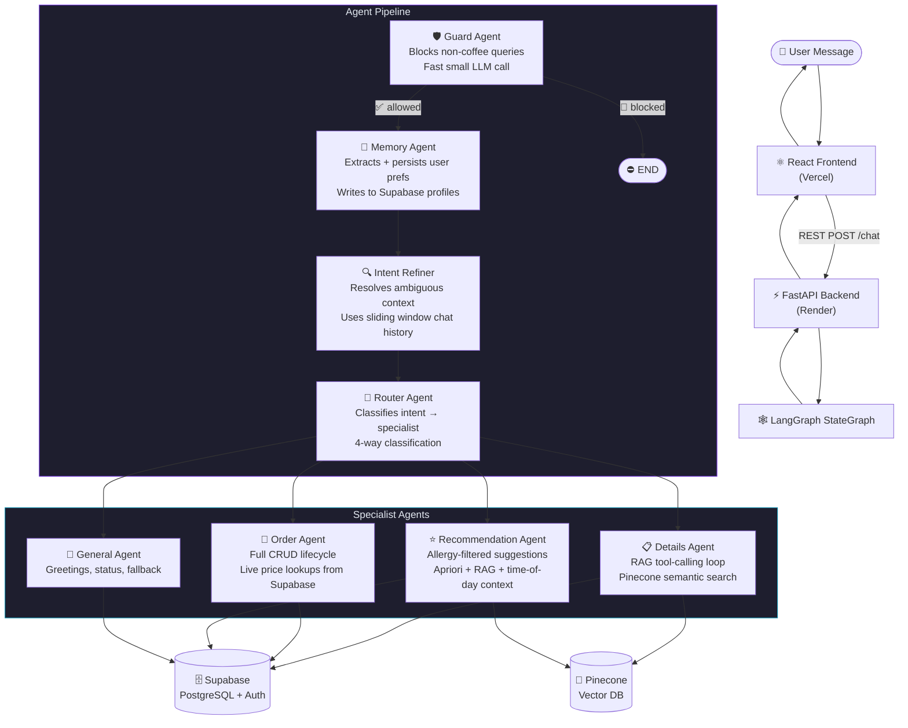

<div align="center">

# ☕ Merry's Way — Agentic AI Coffee Shop Assistant

<p align="center">
  
  
  
  
  
</p>

<p align="center">
  <a href="https://coffee-shop-chat-bot.vercel.app"><strong>🌐 Live Demo</strong></a> &nbsp;·&nbsp;
  <a href="https://coffee-shop-chatbot.onrender.com/docs"><strong>📡 API Docs</strong></a> &nbsp;·&nbsp;
  <a href="https://www.youtube.com/watch?v=APp6CWFgrXw"><strong>🎥 Video Walkthrough</strong></a>
</p>

<br/>

> **A production-grade multi-agent AI system** that turns natural language into a fully managed coffee shop experience — orders, recommendations, user memory, and admin analytics — all through a single conversational interface.

</div>

---

## 🧠 Why This Exists

Most AI chatbots treat every message the same way: one prompt, one LLM call, one response. That works for FAQs. It breaks down the moment you need real business logic — allergy filtering, live price lookups, order lifecycle management, semantic search over a product catalog, and persistent user memory across sessions.

Merry's Way is built on a different premise: **each concern deserves its own agent, with its own tools, context window, and failure boundary.** A Guard agent that blocks off-topic queries has no business knowing your order history. A Recommendation agent that understands your preferences has no business running SQL.

This separation is what makes the system both maintainable and surprisingly capable.

---

## 🏗️ Architecture

The request lifecycle flows through a directed LangGraph state graph. Every message enters at the Guard and exits from a specialist agent — the intermediate nodes never talk to the user, they only transform state.


```mermaid
flowchart TD
    User(["👤 User Message"]) --> FE["⚛️ React Frontend\n(Vercel)"]
    FE -->|"REST POST /chat"| API["⚡ FastAPI Backend\n(Render)"]
    API --> Graph["🕸️ LangGraph StateGraph"]

    subgraph PIPELINE ["Agent Pipeline"]
        direction TB
        Guard["🛡️ Guard Agent\nBlocks non-coffee queries\nFast small LLM call"]
        Memory["🧠 Memory Agent\nExtracts + persists user prefs\nWrites to Supabase profiles"]
        Refiner["🔍 Intent Refiner\nResolves ambiguous context\nUses sliding window chat history"]
        Router["🔀 Router Agent\nClassifies intent → specialist\n4-way classification"]

        Guard -->|"✅ allowed"| Memory
        Guard -->|"🚫 blocked"| STOP(["⛔ END"])
        Memory --> Refiner
        Refiner --> Router
    end

    subgraph SPECIALISTS ["Specialist Agents"]
        direction LR
        Details["📋 Details Agent\nRAG tool-calling loop\nPinecone semantic search"]
        Order["🛒 Order Agent\nFull CRUD lifecycle\nLive price lookups from Supabase"]
        Recommend["⭐ Recommendation Agent\nAllergy-filtered suggestions\nApriori + RAG + time-of-day context"]
        General["💬 General Agent\nGreetings, status, fallback"]
    end

    Router --> Details
    Router --> Order
    Router --> Recommend
    Router --> General

    Details & Order & Recommend & General --> DB[("🗄️ Supabase\nPostgreSQL + Auth")]
    Details & Recommend --> VDB[("🔷 Pinecone\nVector DB")]

    Graph --> API
    API --> FE
    FE --> User

    style PIPELINE fill:#1e1e2e,stroke:#7c3aed,color:#e2e8f0
    style SPECIALISTS fill:#1e1e2e,stroke:#0891b2,color:#e2e8f0
```

### Why LangGraph over plain LangChain chains?

LangGraph gives us a **stateful directed graph** with explicit node transitions. This matters for three reasons:

1. **Conditional routing is first-class** — the Router node inspects the current `AgentState` and returns a different node name based on classified intent. No if-else spaghetti in application code.
2. **Shared state across nodes** — the Memory agent writes `user_preferences` to the state object; the Recommendation agent reads it downstream. No global variables, no re-querying the database.
3. **Failure isolation** — if the Recommendation agent throws an unhandled exception, the graph catches it at the node boundary. Guard and Memory side-effects (Supabase writes) are already committed.

---

## 🤖 Agent Deep Dive

| Agent | Model Tier | Tools | Key Design Decision |
|-------|-----------|-------|---------------------|
| **Guard** | Fast (small LLM) | None | Stateless, no memory access. Must be cheap — runs on every single request |
| **Memory** | Full LLM | `upsert_user_memory` → Supabase | Runs even if the message has no explicit preference — extracts implicit signals like "I don't like bitter things" |
| **Intent Refiner** | Full LLM | Chat history (last N turns) | Resolves pronouns and ellipsis before Router sees the query. "I'll take two of those" becomes "I'll take two Cappuccinos" |
| **Router** | Full LLM | None | 4-class classifier. Prompt uses explicit decision boundaries + few-shot examples per class. No tool calls |
| **Details** | Full LLM | `rag_search`, `get_product_info`, `get_about_us` | Agentic tool-calling loop — can call `rag_search` multiple times with refined queries if the first retrieval is insufficient |
| **Order** | Full LLM | `create_order`, `update_order`, `confirm_order`, `cancel_order`, `get_price` | Manages full order state machine. Price lookups always hit Supabase — LLM-generated prices are never trusted |
| **Recommendation** | Full LLM | `rag_search`, `get_user_memory`, `get_apriori_pairs` | Three-signal recommendation: semantic similarity (Pinecone) + user memory (Supabase) + market basket associations (Apriori). Allergy filter applied as a post-retrieval hard constraint in Python |
| **General** | Full LLM | `get_order_status` | Greetings, small talk, order status. Intentionally limited scope |

---

## 📦 Feature Breakdown

### 🔐 Authentication
JWT-based auth via Supabase Auth. Every `/chat` request is authenticated — the `user_email` extracted from the token is the partition key for all per-user data (memory, sessions, orders).

### 🧠 Persistent User Memory
The Memory agent writes structured preference objects to `coffee_shop_profiles` after every interaction. On the next session, the Recommendation agent loads this profile before generating suggestions. A user who mentioned a nut allergy three weeks ago will never be recommended a hazelnut latte.

### 🔍 Agentic RAG (Details Agent)
Standard RAG is a single retrieval + generation. The Details agent runs a **tool-calling loop**: it retrieves from Pinecone, decides if the result is sufficient, and optionally refines the query and retrieves again. This handles multi-hop questions like *"Do you have anything dairy-free that pairs well with your strongest espresso?"* which require two distinct retrieval passes.

### 🛒 Order Lifecycle
Order state machine: `draft → confirmed → cancelled`. The Order agent never generates prices from parametric knowledge — it always calls `get_price(product_id)` against Supabase. This prevents hallucinated prices from entering confirmed orders.

### ⭐ Personalized Recommendations
Three signals combined at inference time:
- **Semantic search** (Pinecone): finds products similar to the user's stated preferences
- **User memory** (Supabase): loads historical likes/dislikes/allergies
- **Market basket** (Apriori JSON): if user has an active order, adds frequently co-purchased items

---

## 🛠️ Tech Stack

### Backend
| Layer | Technology |
|-------|-----------|
| Runtime | Python 3.11, FastAPI, Uvicorn / Gunicorn |
| Agent Framework | LangGraph (StateGraph), LangChain (tool binding, prompt templates) |
| LLM | `arcee-ai/trinity-large-preview` via [OpenRouter](https://openrouter.ai) |
| Embeddings | `BAAI/bge-base-en-v1.5` via HuggingFace Inference API |
| Vector Store | Pinecone — semantic product search, multi-tenant namespace per index |
| Database | Supabase (PostgreSQL + Auth) — users, sessions, orders, memory |
| Observability | LangSmith (tracing), structured logging |

### Frontend
| Layer | Technology |
|-------|-----------|
| Framework | React 18, Vite, Tailwind CSS |
| Routing | React Router v6 |
| Markdown | react-markdown + remark-gfm |
| State | React Context — AuthContext + CartContext |

### Infrastructure
| Component | Platform |
|-----------|---------|
| Backend | Render (Docker, auto-deploy from `main`) |
| Frontend | Vercel (SPA rewrites via `vercel.json`) |
| Config | `render.yaml` — one-click Render deploy |

---

## 🗂️ Project Structure

```
Coffee_Shop_ChatBot/
├── backend/
│   ├── api/
│   │   ├── routers/            # auth, chat, orders, products, users
│   │   ├── auth/               # Supabase JWT adapter
│   │   └── schemas.py          # Pydantic request/response models
│   ├── src/
│   │   ├── agents/             # 8 specialist agents — one file per agent
│   │   ├── graph/              # LangGraph AgentState + graph builder
│   │   ├── memory/             # User profile CRUD + Supabase client
│   │   ├── orders/             # Order persistence layer
│   │   ├── rag/                # Pinecone retriever (pooled, lazy-initialized)
│   │   ├── sessions/           # Chat session + message persistence
│   │   ├── tools/              # RAG tool, product info tool, about-us tool
│   │   └── config.py           # Centralised settings via pydantic-settings
│   ├── data/
│   │   ├── products_data/      # Menu text, product JSONL, about-us copy
│   │   ├── apriori_recommendations.json
│   │   └── popularity_recommendation.csv
│   ├── Dockerfile
│   └── requirements.txt
├── frontend/
│   ├── src/
│   │   ├── components/         # Chatbot, Menu, Order, Login, Register
│   │   ├── context/            # AuthContext, CartContext
│   │   └── services/api.js     # Centralised API layer — all fetch calls here
│   └── vercel.json             # SPA rewrite rules
└── render.yaml                 # Render deploy config
```

---

## 🔧 Key Engineering Challenges

### 1. Supabase Connection Crash on Render Cold Start

**Symptom**: Backend crashed at startup on Render with a PostgreSQL connection refused error. No requests were ever served.

**Root cause (two stacked issues)**:
- Port misconfiguration: the connection string used `6543` (Supabase's PgBouncer pooler) instead of `5432` (direct PostgreSQL).
- Eager initialization: the `SQLDatabase` object was instantiated at module import time. On Render's cold start, if the DB handshake took longer than the import window, the entire process died before Uvicorn could start.

**Fix**: Corrected port to `5432` and refactored all database clients to use **lazy initialization** — connections are created on the first request, not at import time. Cold starts now complete reliably.

### 2. Router Misclassification on Inventory-Customer Boundary Queries

**Symptom**: Queries like *"How many lattes are left?"* were routed to the Customer agent instead of the Details agent, producing wrong answers.

**Root cause**: The Router's system prompt had fuzzy class boundaries for inventory-aware queries that could plausibly be customer-facing.

**Fix**: Added explicit decision boundary rules and three few-shot examples per edge case in the Router's system prompt.

### 3. Recommendation Agent Returning Allergen-Containing Items

**Symptom**: A user with a documented nut allergy was occasionally recommended hazelnut products.

**Root cause**: Allergen filtering was done by LLM reasoning ("this probably contains nuts") rather than hard constraint. LLM reasoning-based filtering is unreliable.

**Fix**: Moved allergen filtering to a **post-retrieval hard constraint in Python**. After candidates are retrieved, a deterministic function cross-references the user's allergen list against product metadata before anything reaches the LLM. The LLM never sees allergen-incompatible products.

---

## 🚀 Local Development

### Prerequisites
- Python 3.11+, Node 18+
- Accounts: Supabase, Pinecone, OpenRouter, HuggingFace

### Backend

```bash
cd backend
python -m venv .venv && source .venv/bin/activate  # Windows: .venv\Scripts\activate
pip install -r requirements.txt
cp .env.example .env   # fill in all keys
uvicorn api.main:app --reload
# API: http://localhost:8000
# Docs: http://localhost:8000/docs
```

### Frontend

```bash
cd frontend
npm install
echo "VITE_API_URL=http://localhost:8000" > .env
npm run dev
# App: http://localhost:5173
```

---

## 🔑 Environment Variables

### Backend `.env`

```env
# LLM
OPENROUTER_API_KEY=
LLM_MODEL=arcee-ai/trinity-large-preview:free

# Embeddings
HF_API_KEY=
EMBEDDING_MODEL=BAAI/bge-base-en-v1.5

# Vector Store
PINECONE_API_KEY=
PINECONE_INDEX_NAME=coffee-products

# Database — use port 5432 (direct), NOT 6543 (pooler)
SUPABASE_URL=
SUPABASE_KEY=
SUPABASE_SERVICE_KEY=

# CORS
ALLOWED_ORIGINS=https://your-app.vercel.app

# Observability (optional but recommended)
LANGCHAIN_API_KEY=
LANGSMITH_TRACING_V2=false
LANGCHAIN_PROJECT=coffee-shop-chatbot
```

### Frontend `.env`

```env
VITE_API_URL=http://localhost:8000
```

---

## 🗄️ Database Schema

```sql
-- User preferences — persisted across sessions by Memory agent
CREATE TABLE coffee_shop_profiles (
  user_email   TEXT PRIMARY KEY,
  name         TEXT,
  likes        TEXT[],
  dislikes     TEXT[],
  allergies    TEXT[],           -- hard constraint for Recommendation agent
  last_order   TEXT,
  feedback     TEXT[],
  location     TEXT,
  last_updated TIMESTAMPTZ DEFAULT NOW()
);

-- Chat sessions
CREATE TABLE chat_sessions (
  session_id TEXT PRIMARY KEY,
  user_email TEXT NOT NULL,
  created_at TIMESTAMPTZ DEFAULT NOW()
);

-- Individual messages — restored on page reload
CREATE TABLE chat_messages (
  id         BIGSERIAL PRIMARY KEY,
  session_id TEXT REFERENCES chat_sessions(session_id) ON DELETE CASCADE,
  user_email TEXT NOT NULL,
  role       TEXT NOT NULL CHECK (role IN ('human', 'ai')),
  content    TEXT NOT NULL,
  created_at TIMESTAMPTZ DEFAULT NOW()
);

-- Orders — managed exclusively by Order agent
CREATE TABLE orders (
  id         UUID PRIMARY KEY DEFAULT gen_random_uuid(),
  user_email TEXT NOT NULL,
  items      JSONB NOT NULL DEFAULT '[]',
  total      FLOAT NOT NULL DEFAULT 0,
  status     TEXT NOT NULL DEFAULT 'active',  -- active | confirmed | cancelled
  updated_at TIMESTAMPTZ DEFAULT NOW()
);
```

---

## 💬 Example Conversation

```
User:  hi
Bot:   Hey! Welcome to Merry's Way ☕ What can I get you today?

User:  I'm allergic to nuts
Bot:   Got it — keeping nuts out of all suggestions from now on.

User:  what do you recommend for a cold morning?
Bot:   Given the chill, I'd suggest our Dark Chocolate Drinking Chocolate (₹500)
       — rich, warming, and completely nut-free for you.
       Or a classic Cappuccino (₹450)?

User:  I'll take 2 cappuccinos and a croissant
Bot:   Here's your order:
       • Cappuccino x2 @ ₹450.00 = ₹900.00
       • Croissant x1 @ ₹325.00 = ₹325.00
       🧾 Total: ₹1,225.00
       Shall I confirm?

User:  yes
Bot:   ✅ Order confirmed! Receipt sent to your email.
```

---

## 🗺️ Roadmap

| Phase | Feature | Status |
|-------|---------|--------|
| 1 | LangSmith observability + RAGAS baseline | ⬜ Next |
| 2 | SSE token streaming (first token < 500ms) | ⬜ Planned |
| 3 | Admin panel — product CRUD + analytics chatbot (Text-to-SQL) | ⬜ Planned |
| 4 | Human-in-the-loop with `PostgresSaver` + LangGraph `interrupt()` | ⬜ Planned |
| 5 | Voice ordering (Twilio → WebRTC Realtime) | ⬜ Backlog |
| 6 | AWS production deployment (ECS Fargate + CloudFront) | ⬜ Backlog |
| — | Tiered LLM routing (small model for Guard + Router) | ⬜ Architecture |
| — | Kuzu graph DB for hybrid vector + graph retrieval | ⬜ Architecture |
| — | Semantic response caching with Redis + GPTCache | ⬜ Architecture |

---

## 📄 License

MIT — see [LICENSE](backend/LICENSE)
