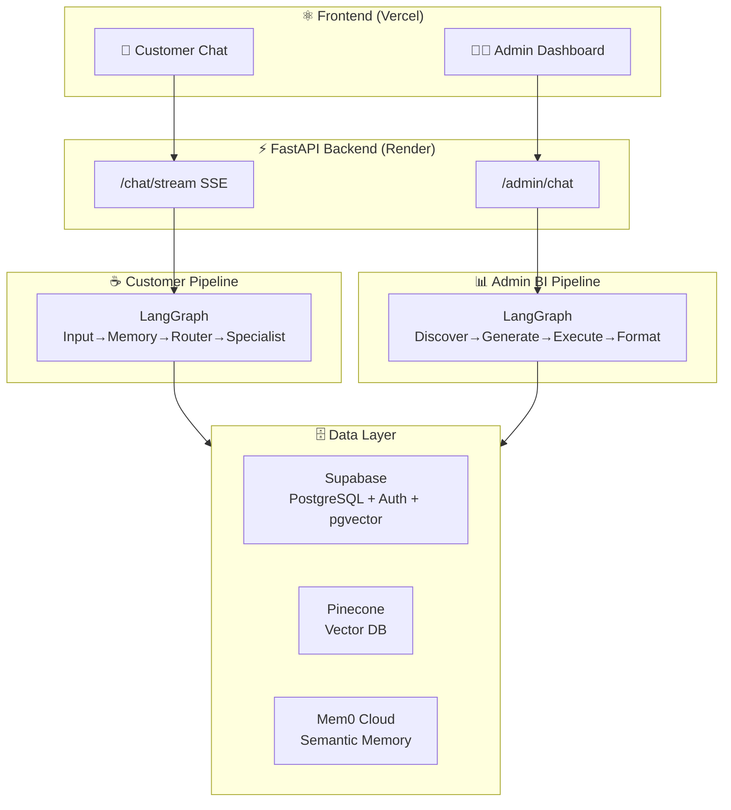

<div align="center">


<p>
  
  
  
  
  
  
  
</p>

<p>
  <a href="https://coffee-shop-chat-bot.vercel.app"><strong>🌐 Live Demo</strong></a> &nbsp;·&nbsp;
  <a href="https://coffee-shop-chatbot.onrender.com/docs"><strong>📡 API Docs</strong></a> &nbsp;·&nbsp;
  <a href="https://www.youtube.com/watch?v=APp6CWFgrXw"><strong>🎥 Video Walkthrough</strong></a> &nbsp;·&nbsp;
  <a href="./backend/README.md"><strong>⚙️ Backend Docs</strong></a> &nbsp;·&nbsp;
  <a href="./frontend/README.md"><strong>🎨 Frontend Docs</strong></a>
</p>

</div>

---

## What Is This?

**Merry's Way** is a production-grade AI coffee shop assistant with two independent interfaces:

| Interface | Who Uses It | What It Does |
|-----------|------------|-------------|
| **💬 Customer Chatbot** | End customers | Natural language ordering, personalized recommendations, persistent memory, real-time streaming |
| **🧑‍💼 Admin BI Dashboard** | Shop owner | Natural language analytics — "show revenue this month as a bar chart" |

Both are powered by **LangGraph multi-agent pipelines** sharing a single FastAPI backend. No hardcoded responses — every reply is generated by an agent with access to the live database.

---

## 👤 Customer Experience

A customer opens the app and chats naturally. The system handles the rest.

```
"I'm allergic to nuts"          → Memory agent stores this permanently
"What's good today?"            → Hybrid recommender filters out ALL nut products
"I'll take 2 cappuccinos"       → Order agent looks up live prices from Supabase
"confirm"                       → Graph pauses, shows payment UI (HITL)
[clicks Pay & Confirm]          → Order confirmed, email receipt sent
```

On next visit, the system already knows about the nut allergy. No re-telling.

### Customer Agent Pipeline

```
Every message passes through this graph in order:

┌─────────────────────────────────────────────────────────────────────────┐
│                         Customer Pipeline                               │
│                                                                         │
│  User Input                                                             │
│      │                                                                  │
│      ▼                                                                  │
│  ┌──────────────┐    Resolves ambiguity ("those" → "Cappuccinos")       │
│  │ Input        │    Uses last 6 messages as sliding context window     │
│  │ Processor    │                                                       │
│  └──────┬───────┘                                                       │
│         │                                                               │
│         ▼                                                               │
│  ┌──────────────┐    Extracts preferences from the message              │
│  │ Memory       │    Writes to Supabase profiles + Mem0 Cloud           │
│  │ Agent        │    ("I hate bitter things" → dislikes: ["bitter"])    │
│  └──────┬───────┘                                                       │
│         │                                                               │
│         ▼                                                               │
│  ┌──────────────┐    Classifies intent into one of 4 routes:           │
│  │ Router       │    details / order / recommendation / general         │
│  │ Agent        │    Uses structured output — no ambiguous text parsing │
│  └──────┬───────┘                                                       │
│         │                                                               │
│    ┌────┴────────────────────────┐                                      │
│    │                             │                                      │
│    ▼                             ▼                  ▼           ▼       │
│ ┌────────┐  ┌──────────────┐  ┌──────────────┐  ┌───────┐             │
│ │Details │  │    Order     │  │ Recommend    │  │General│             │
│ │Agent   │  │    Agent     │  │ Agent        │  │Agent  │             │
│ │        │  │              │  │              │  │       │             │
│ │RAG     │  │CRUD + HITL   │  │Hybrid model: │  │Stream │             │
│ │loop    │  │interrupt()   │  │popularity +  │  │tokens │             │
│ │Pinecone│  │Live prices   │  │apriori +     │  │SSE    │             │
│ │search  │  │from Supabase │  │content-based │  │       │             │
│ └────────┘  └──────────────┘  └──────────────┘  └───────┘             │
└─────────────────────────────────────────────────────────────────────────┘
```

**Key design principle:** Prices always come from Supabase. The LLM never invents a number.  
**Allergen safety:** Python hard-filters allergen products *before* the LLM ever sees them.

---

## 🧑‍💼 Admin Experience

The shop owner asks business questions in plain English.

```
"Show top 5 products by revenue this month as a bar chart"
   → [Renders bar chart]

"Compare that to last month"
   → History-aware — runs a comparative SQL query
   → [Renders line chart with trend analysis]
```

### Admin BI Pipeline (Completely Separate from Customer)

```
Admin Query
    │
    ▼
┌─────────────────────────────────────────────────────────────────────────┐
│                     Admin BI Agent (4-Node LangGraph)                  │
│                                                                         │
│  ┌─────────────┐                                                        │
│  │  Discovery  │  Embeds the query → searches schema metadata           │
│  │    Node     │  (pgvector) → builds context of relevant tables        │
│  └──────┬──────┘  + columns                                            │
│         │                                                               │
│         ▼                                                               │
│  ┌─────────────┐                                                        │
│  │  Generation │  Groq LLM receives: schema + query + chat history      │
│  │    Node     │  → generates raw PostgreSQL                           │
│  └──────┬──────┘                                                        │
│         │                                                               │
│         ▼                                                               │
│  ┌─────────────┐                                                        │
│  │  Execution  │  Runs SQL via Supabase RPC                            │
│  │    Node     │  PII (emails, names) masked before LLM sees results   │
│  └──────┬──────┘                                                        │
│         │                              ┌──────────────────────┐        │
│         │── SQL error? ────────────────▶ Back to Generation   │        │
│         │   (up to 2 retries,          │ with error injected  │        │
│         │    error fed back            └──────────────────────┘        │
│         │    into prompt)                                               │
│         │                                                               │
│         ▼                                                               │
│  ┌─────────────┐                                                        │
│  │  Formatting │  LLM produces structured JSON:                        │
│  │    Node     │  { narrative, chart_type, chart_data, sql }           │
│  └─────────────┘  React renders the chart directly from this state     │
│                                                                         │
└─────────────────────────────────────────────────────────────────────────┘
```

---

## 🏛️ System Overview


```mermaid
graph TB
    subgraph Frontend["⚛️ Frontend (Vercel)"]
        CB["💬 Customer Chat"]
        AD["🧑‍💼 Admin Dashboard"]
    end

    subgraph Backend["⚡ FastAPI Backend (Render)"]
        CR["/chat/stream  SSE"]
        AR["/admin/chat"]
    end

    subgraph Customer["☕ Customer Pipeline"]
        CG["LangGraph\nInput→Memory→Router→Specialist"]
    end

    subgraph Admin["📊 Admin BI Pipeline"]
        AG["LangGraph\nDiscover→Generate→Execute→Format"]
    end

    subgraph Data["🗄️ Data Layer"]
        SB["Supabase\nPostgreSQL + Auth + pgvector"]
        PC["Pinecone\nVector DB"]
        M0["Mem0 Cloud\nSemantic Memory"]
    end

    CB --> CR --> CG --> Data
    AD --> AR --> AG --> Data
```

---

## 🛠️ Tech Stack (Quick View)

| Layer | Technology |
|-------|-----------|
| **LLM** | Groq `llama-3.3-70b-versatile` + OpenRouter fallback |
| **Agent Framework** | LangGraph (StateGraph, interrupt, checkpointing) |
| **Embeddings** | `BAAI/bge-base-en-v1.5` via HuggingFace |
| **Semantic Memory** | Mem0 Cloud |
| **Vector Search** | Pinecone |
| **Database** | Supabase (PostgreSQL + Auth + pgvector) |
| **Backend** | FastAPI + Uvicorn, Python 3.12, `uv` |
| **Frontend** | React 18, Vite, Tailwind CSS, Recharts |
| **Streaming** | Server-Sent Events (SSE) |
| **Deploy** | Render (backend Docker) + Vercel (frontend) |

---

## 🚀 Quick Start

```bash
# 1. Clone
git clone https://github.com/Pandharimaske/Coffee_Shop_ChatBot.git
cd Coffee_Shop_ChatBot

# 2. Backend
cd backend
pip install uv && uv sync
cp .env.example .env      # fill in API keys
uv run uvicorn api.main:app --reload --reload-dir api --reload-dir src

# 3. Frontend (new terminal)
cd frontend
npm install
echo "VITE_API_URL=http://localhost:8000" > .env
npm run dev
```

API runs at `http://localhost:8000` · Docs at `http://localhost:8000/docs`  
App runs at `http://localhost:5173`

---

## 📂 Repository Structure

```
Coffee_Shop_ChatBot/
├── README.md               ← You are here (project overview)
├── backend/
│   ├── README.md           ← Backend deep-dive (agents, API, DB schema, env vars)
│   ├── api/                # FastAPI routers + auth + schemas
│   ├── src/                # Agents, graph, memory, tools, recommender, sessions
│   ├── scripts/            # DB seeding, BI agent setup, image migration
│   ├── data/               # Apriori JSON, popularity CSV, product JSONL
│   └── supabase_db/        # SQL schema files
└── frontend/
    ├── README.md           ← Frontend deep-dive (components, SSE, state)
    └── src/
        ├── components/     # Chatbot, AdminDashboard, Menu, Auth
        ├── context/        # AuthContext, CartContext
        └── services/       # api.js — centralised API layer
```

> **Deep-dive docs:** [⚙️ Backend README](./backend/README.md) · [🎨 Frontend README](./frontend/README.md)

---

## 📄 License

MIT — see [LICENSE](backend/LICENSE)

<div align="center">

<p>Built with ☕ by <strong>Pandhari Maske</strong></p>
</div>
