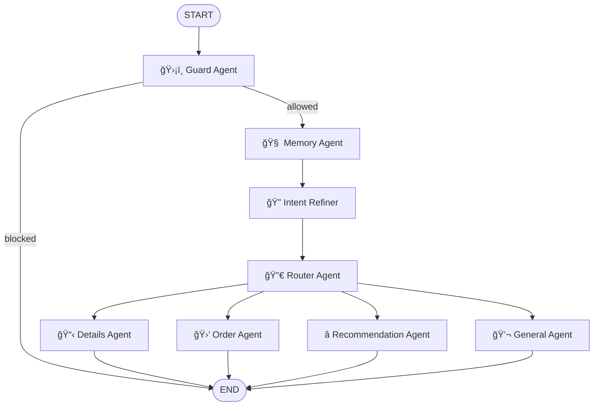

# ☕ Merry's Way — Coffee Shop Chatbot

An AI-powered coffee shop assistant for **Merry's Way**, a fictional café in Greenwich Village, NYC. Built with a multi-agent LangGraph pipeline, the bot handles orders, recommendations, menu queries, and remembers your preferences across sessions.

---

## 🔗 Quick Links

- 🌠**Live Demo**: [coffee-shop-chat-bot.vercel.app](https://coffee-shop-chat-bot.vercel.app)
- âš™ï¸ **API Docs**: [coffee-shop-chatbot.onrender.com/docs](https://coffee-shop-chatbot.onrender.com/docs)
- 🥠**Video Demo**: [Watch on YouTube](https://www.youtube.com/watch?v=APp6CWFgrXw)

---

## ğŸ—ï¸ Architecture Overview

```
User → React Frontend → FastAPI Backend → LangGraph Multi-Agent Pipeline → Supabase + Pinecone
```

Every message flows through a directed agent graph:



---

## 🤖 Agent Pipeline

| Agent | Role |
|-------|------|
| **Guard** | Blocks off-topic queries, allows coffee-related ones through |
| **Memory** | Extracts user preferences (likes, dislikes, allergies) and persists them to Supabase |
| **Intent Refiner** | Resolves ambiguous or context-dependent queries using chat history |
| **Router** | Classifies intent and routes to the right specialist agent |
| **Details** | Answers product/shop questions using agentic RAG tool-calling |
| **Order** | Full order lifecycle — CREATE, UPDATE, CONFIRM, CANCEL with real price lookups |
| **Recommendation** | Personalized suggestions using RAG + user memory + time-of-day context |
| **General** | Greetings, small talk, order status, fallback |

---

## 📦 Features

- **Multi-agent LangGraph pipeline** with clean separation of concerns
- **JWT authentication** via Supabase Auth (register, login, token validation)
- **Persistent user memory** — likes, dislikes, allergies saved across sessions
- **Agentic RAG** — Details agent uses tool-calling loop over Pinecone vector DB
- **Personalized recommendations** filtered by allergies + time-of-day context
- **Full order management** — create, modify, confirm, cancel with live price lookups
- **Session-based chat history** — messages saved and restored on reload
- **Markdown rendering** — bot responses render bold, bullets, links natively
- **Apriori market basket data** — pre-computed product associations for recommendations

---

## ğŸ› ï¸ Tech Stack

### Backend
- **Python 3.11**, **FastAPI**, **Uvicorn / Gunicorn**
- **LangGraph** — multi-agent state graph orchestration
- **LangChain** — LLM chains, tool binding, prompt templates
- **LLM** — `arcee-ai/trinity-large-preview` via [OpenRouter](https://openrouter.ai)
- **Embeddings** — `BAAI/bge-base-en-v1.5` via HuggingFace Inference API
- **Pinecone** — vector database for semantic product search
- **Supabase** — PostgreSQL database + Auth (users, sessions, orders, memory)

### Frontend
- **React 18**, **Vite**, **Tailwind CSS**
- **React Router** — client-side routing
- **react-markdown + remark-gfm** — markdown rendering in chat
- **React Context** — auth state + cart state management

### Infrastructure
- **Render** — backend Docker deployment
- **Vercel** — frontend deployment with SPA rewrites

---

## ğŸ—‚ï¸ Project Structure

```
Coffee_Shop_ChatBot/
├── backend/
│   ├── api/                    # FastAPI app
│   │   ├── routers/            # auth, chat, orders, products, users
│   │   ├── auth/               # Supabase auth adapter
│   │   └── schemas.py          # Pydantic request/response models
│   ├── src/
│   │   ├── agents/             # 8 specialist agents (guard, memory, router…)
│   │   ├── graph/              # LangGraph state + graph builder
│   │   ├── memory/             # User memory CRUD + Supabase client
│   │   ├── orders/             # Order persistence
│   │   ├── rag/                # Pinecone retriever (pooled, multi-tenant)
│   │   ├── sessions/           # Chat session + message persistence
│   │   ├── tools/              # RAG tool, product info tool, about-us tool
│   │   └── config.py           # Centralised settings (pydantic-settings)
│   ├── data/
│   │   ├── products_data/      # Menu text, product JSONL, about-us copy
│   │   ├── apriori_recommendations.json
│   │   └── popularity_recommendation.csv
│   ├── Dockerfile
│   └── requirements.txt
├── frontend/
│   ├── src/
│   │   ├── components/         # Chatbot, Menu, Order, Login, Register…
│   │   ├── context/            # AuthContext, CartContext
│   │   └── services/api.js     # Centralised API layer
│   └── vercel.json
└── render.yaml                 # One-click Render deploy config
```

---

## 🚀 Local Development

### Prerequisites
- Python 3.11+
- Node 18+
- Accounts: Supabase, Pinecone, OpenRouter, HuggingFace

### Backend

```bash
cd backend
python -m venv .venv && source .venv/bin/activate
pip install -r requirements.txt
```

Create `backend/.env` (see `.env.example` below), then:

```bash
uvicorn api.main:app --reload
# API running at http://localhost:8000
# Docs at http://localhost:8000/docs
```

### Frontend

```bash
cd frontend
npm install
# Create frontend/.env with:
# VITE_API_URL=http://localhost:8000
npm run dev
# App running at http://localhost:5173
```

---

## 🔑 Environment Variables

### Backend `.env`

```env
# LLM
OPENROUTER_API_KEY=
LLM_MODEL=arcee-ai/trinity-large-preview:free

# Embeddings
HF_API_KEY=
EMBEDDING_MODEL=BAAI/bge-base-en-v1.5

# Pinecone
PINECONE_API_KEY=
PINECONE_INDEX_NAME=coffee-products

# Supabase
SUPABASE_URL=
SUPABASE_KEY=
SUPABASE_SERVICE_KEY=

# Production CORS (comma-separated)
ALLOWED_ORIGINS=https://your-app.vercel.app

# Optional: LangSmith tracing
LANGCHAIN_API_KEY=
LANGSMITH_TRACING_V2=false
```

### Frontend `.env`

```env
VITE_API_URL=http://localhost:8000
```

---

## ğŸ—„ï¸ Database Schema (Supabase)

```sql
-- User preferences + memory
CREATE TABLE coffee_shop_profiles (
  user_email TEXT PRIMARY KEY,
  name TEXT, likes TEXT[], dislikes TEXT[],
  allergies TEXT[], last_order TEXT,
  feedback TEXT[], location TEXT,
  last_updated TIMESTAMPTZ DEFAULT NOW()
);

-- Chat sessions
CREATE TABLE chat_sessions (
  session_id TEXT PRIMARY KEY,
  user_email TEXT NOT NULL,
  created_at TIMESTAMPTZ DEFAULT NOW()
);

-- Chat messages
CREATE TABLE chat_messages (
  id BIGSERIAL PRIMARY KEY,
  session_id TEXT REFERENCES chat_sessions(session_id) ON DELETE CASCADE,
  user_email TEXT NOT NULL,
  role TEXT NOT NULL CHECK (role IN ('human', 'ai')),
  content TEXT NOT NULL,
  created_at TIMESTAMPTZ DEFAULT NOW()
);

-- Orders
CREATE TABLE orders (
  id UUID PRIMARY KEY DEFAULT gen_random_uuid(),
  user_email TEXT NOT NULL,
  items JSONB NOT NULL DEFAULT '[]',
  total FLOAT NOT NULL DEFAULT 0,
  status TEXT NOT NULL DEFAULT 'active',
  updated_at TIMESTAMPTZ DEFAULT NOW()
);
```

---

## 💬 Example Conversations

```
User: hi
Bot:  Hey Pandhari! Welcome to Merry's Way ☕ What can I get you today?

User: I'm allergic to nuts
Bot:  Got it! I'll make sure to keep nuts out of any recommendations.

User: what do you recommend for a cold morning?
Bot:  Given the chilly weather, I'd suggest our Dark Chocolate Drinking Chocolate (₹500)
      — rich, warming, and completely nut-free for you. Or a classic Cappuccino (₹450)?

User: I'll take 2 cappuccinos and a croissant
Bot:  Here's your order:
      • Cappuccino x2 @ ₹450.00 = ₹900.00
      • Croissant x1 @ ₹325.00 = ₹325.00
      🧾 Total: ₹1225.00
      Shall I confirm this order?

User: yes
Bot:  ✅ Order confirmed! Receipt sent to your email.
      💳 Complete payment: https://merrysway.coffee/pay/...
```

---

## 🧩 Roadmap

- [ ] Payment gateway integration
- [ ] Streaming responses (SSE)
- [ ] Voice assistant support
- [ ] Shop owner analytics dashboard
- [ ] Mobile app (React Native)
- [ ] Multi-language support

---

## 🤠Contributing

Contributions and ideas are welcome! Please open an issue or submit a pull request.

---

## 📄 License

MIT — see [LICENSE](backend/LICENSE)
